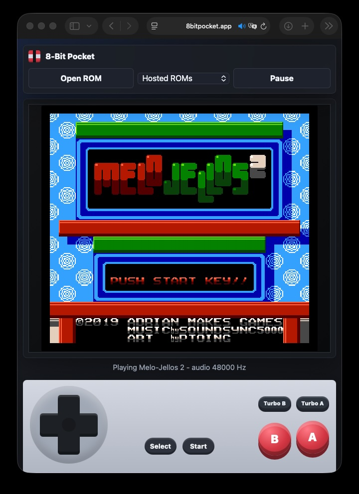

# 8-Bit Pocket

A mobile-first NES emulator web app powered by [JSNES](https://github.com/bfirsh/jsnes). It runs fully in the browser, opens local `.nes` files without uploading them anywhere, and is deployed as a static site on AWS.

Live site: [https://8bitpocket.app](https://8bitpocket.app)



## Try It

Open [8bitpocket.app](https://8bitpocket.app), choose **Melo-Jellos 2** from **Hosted ROMs**, then press **Start**. You can also use **Open ROM** to load a local `.nes` file from your device; local ROM files stay in the browser and are not uploaded.

## Technical Highlights

- Added a mobile touch controller layer for D-pad, A/B, Start, Select, Turbo A, and Turbo B input
- Supports both hosted homebrew ROMs and user-selected local ROM files
- Tuned browser audio with runtime sample-rate sync and mono NES channel mixing
- Hardened the mobile Safari experience against accidental zoom, text selection, and touch callouts
- Ships as a static Vite app with no backend runtime
- Deploys to AWS S3 behind CloudFront with ACM HTTPS, Route 53 DNS, and GitHub Actions CI/CD

## Features

- Browser-based NES hardware emulation with JSNES
- Local ROM loading from the user's device
- Optional hosted ROM picker via `public/roms/manifest.json`
- Touch controls modeled after an NES controller
- Turbo A and Turbo B controls for casual mobile play
- Authentic mono audio mix, matching the original NES output
- Runtime audio sample-rate sync for desktop/mobile browser audio devices
- Mobile Safari UX hardening:
  - reduced accidental double-tap zoom
  - disabled text selection and touch callouts
  - controller controls kept inside the controller shell in portrait and landscape
- Static hosting with S3, CloudFront, ACM, Route 53, and GitHub Actions CI/CD

## Architecture

```txt
Vite static app
  -> JSNES browser emulator
  -> local ROM file reader / hosted ROM manifest
  -> S3 private static origin
  -> CloudFront HTTPS distribution
  -> Route 53 custom domain
  -> GitHub Actions build, deploy, and CloudFront invalidation
```

The app has no backend. User-selected ROM files are read locally by the browser and are not sent to the server.

## ROMs

This repository includes one redistributable homebrew demo ROM, **Melo-Jellos 2**, for the hosted ROM picker. It is licensed separately from the app under CC-BY-SA 4.0. See `THIRD_PARTY_ROMS.md` for attribution, source, license, and checksum details.

For any other games, use public-domain, homebrew, or otherwise legally licensed ROM files.

Local test ROMs are ignored by git through `.gitignore`.

To provide additional hosted ROMs, place licensed ROM files in `public/roms/` and list them in `public/roms/manifest.json`:

```json
[
  {
    "title": "Example Homebrew",
    "url": "/roms/example.nes",
    "author": "Example Author",
    "license": "Example License",
    "source": "https://example.com"
  }
]
```

ROM files are ignored by default. Add narrow `.gitignore` exceptions only for ROMs that you intentionally want to commit and are confident you can redistribute.

## JSNES Fork

8-Bit Pocket currently pins JSNES to `taiyuuki/jsnes` commit `5b27c4243f1cb2528c54941e13c29c4ced7d5a45`, which includes sprite rendering fixes from [bfirsh/jsnes#666](https://github.com/bfirsh/jsnes/pull/666). The fork is pinned to a specific commit so emulator behavior does not change unexpectedly when new commits land on the fork.

## Known Limitations

8-Bit Pocket uses JSNES directly rather than a heavier accuracy-focused emulator core. Many games run well, especially with the pinned JSNES fork noted above, but some ROMs may still show minor rendering artifacts or other compatibility issues. The goal of this project is a lightweight, mobile-friendly static web emulator for casual play, not cycle-perfect NES emulation.

iOS Safari audio can be picky about user gestures and device audio settings. The app includes an `AudioContext` compatibility fallback and resumes suspended audio on controller input, but some device/browser combinations may still require checking silent mode, volume, or page reload state.

## Development

```sh
npm install
npm run dev
```

Open the local URL shown by Vite, then use **Open ROM** to load a `.nes` file from your device.

## Build

```sh
npm run build
```

The static site is generated in `dist/`.

## Manual S3 Deploy

```sh
aws s3 sync dist s3://nes-emulator-mobile-web-app --delete --exclude ".DS_Store" --exclude "*/.DS_Store"
```

The normal deployment path is GitHub Actions on pushes to `main`.

## HTTPS Domain Infrastructure

The `infrastructure/cloudformation.yml` template creates:

- ACM certificate for `8bitpocket.app` and `www.8bitpocket.app`
- CloudFront distribution with HTTPS redirects
- Route 53 `A` and `AAAA` alias records
- S3 bucket policy that allows CloudFront Origin Access Control to read site files
- GitHub Actions OIDC role for deployment

Deploy the stack in `us-east-1`, which is required for CloudFront ACM certificates:

```sh
aws cloudformation deploy \
  --region us-east-1 \
  --stack-name eightbit-pocket-web \
  --template-file infrastructure/cloudformation.yml \
  --capabilities CAPABILITY_IAM
```

After the stack is created, add these GitHub repository variables:

- `AWS_ROLE_ARN`: stack output `GitHubActionsRoleArn`
- `CLOUDFRONT_DISTRIBUTION_ID`: stack output `CloudFrontDistributionId`

The deploy workflow builds the app, syncs `dist/` to S3, and invalidates CloudFront on pushes to `main`.

## Public S3 Website Fallback

If serving directly from an S3 website endpoint without CloudFront, the bucket needs public object read access:

```json
{
  "Version": "2012-10-17",
  "Statement": [
    {
      "Sid": "PublicReadForStaticWebsite",
      "Effect": "Allow",
      "Principal": "*",
      "Action": "s3:GetObject",
      "Resource": "arn:aws:s3:::nes-emulator-mobile-web-app/*"
    }
  ]
}
```

## License

MIT

Third-party ROM content is licensed separately. See `THIRD_PARTY_ROMS.md`.
